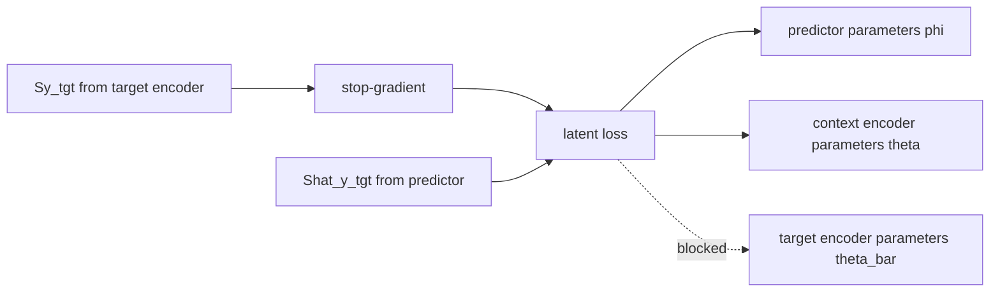

# Text JEPA Flow, Shapes, and Diagrams

## Purpose

This document defines the **full raw text JEPA system** we intend to build:

- masked spans are replaced by `[MASK]` tokens
- the context encoder processes the masked full-length sequence
- the target encoder processes the unmasked full-length sequence
- target encoder outputs are fixed targets
- target encoder parameters are updated by EMA only
- the predictor maps context latents to target latents at masked positions
- the loss is computed only on masked target positions

This is the system-level architecture reference.

The companion implementation plan is:

- `docs/text-jepa-plan.md`

## Evidence Tags

We use three evidence tags throughout:

- **Canonical**: explicit in I-JEPA, data2vec, or the user-defined architecture constraints
- **Adjacent precedent**: explicit in related work such as BYOL, data2vec 2.0, or the public `llm-jepa` repo
- **Design choice**: our chosen implementation detail where literature is not fully prescriptive

## 1. One-Sentence Definition

**Text JEPA** learns a representation by predicting the target encoder's latent states for masked text spans, using a context encoder that sees the same sequence with those spans replaced by `[MASK]`, while gradients flow only through the predictor and context encoder.

## 2. Notation

| Symbol | Meaning |
|---|---|
| `B` | batch size |
| `L` | padded sequence length |
| `V` | vocabulary size |
| `D` | model width / hidden size |
| `H` | number of attention heads |
| `Dh` | per-head dim, `Dh = D / H` |
| `N` | number of encoder layers |
| `P` | number of predictor layers |
| `S` | number of masked spans per sample |
| `T_i` | number of masked target tokens in sample `i` |
| `T_max` | maximum `T_i` in a batch after padding |
| `x_full` | unmasked token ids |
| `x_ctx` | masked-context token ids |
| `m_pad` | padding mask |
| `m_tgt` | target-position mask over the full length |
| `p_tgt` | padded list of target positions |
| `Sx` | context encoder output |
| `Sy` | target encoder output |
| `Q_tgt` | predictor query states |
| `Shat_y` | predicted target latent states |

## 3. High-Level System

```mermaid
flowchart LR
    A[Full token ids x_full<br/>(B, L)] --> B[Span sampler]
    B --> C[Context ids x_ctx<br/>target spans -> [MASK]<br/>(B, L)]
    B --> D[Target positions p_tgt<br/>(B, T_max)]
    B --> E[Target validity mask<br/>(B, T_max)]
    B --> F[Full-length target mask m_tgt<br/>(B, L)]

    C --> G[Context encoder f_theta]
    A --> H[Target encoder f_theta_bar<br/>no grad, EMA only]

    G --> I[Sx<br/>(B, L, D)]
    H --> J[Sy<br/>(B, L, D)]

    D --> K[Predictor query builder]
    I --> K
    K --> L[Predictor g_phi]
    L --> M[Shat_y_tgt<br/>(B, T_max, D)]

    J --> N[Gather target states]
    D --> N
    N --> O[Sy_tgt<br/>(B, T_max, D)]

    M --> P[Masked latent loss]
    O --> P
    E --> P

    P --> Q[Gradients to predictor and context encoder]
    G -. EMA source .-> H
```

## 4. End-to-End Training Sequence

```mermaid
sequenceDiagram
    participant Data as Batch builder
    participant Ctx as Context encoder
    participant Tgt as Target encoder
    participant Pred as Predictor
    participant Loss as Latent loss
    participant Opt as Optimizer
    participant EMA as EMA updater

    Data->>Data: sample spans on x_full
    Data->>Ctx: x_ctx, m_pad
    Data->>Tgt: x_full, m_pad
    Ctx->>Pred: Sx
    Tgt-->>Loss: Sy (stop-gradient)
    Data->>Pred: p_tgt, target_valid_mask
    Pred->>Loss: Shat_y_tgt
    Loss->>Loss: gather Sy_tgt from Sy at p_tgt
    Loss->>Opt: backprop through predictor + context encoder
    Opt->>EMA: update context params
    EMA->>Tgt: theta_bar <- tau * theta_bar + (1 - tau) * theta
```

## 5. Architectural Summary

## 5.1 Context encoder

**Canonical**

- input is the masked sequence with `[MASK]` tokens still occupying the target positions
- output is a contextualized latent at every sequence position

**Shape**

- input ids: `(B, L)`
- attention mask: `(B, L)`
- output: `(B, L, D)`

**Important implication**

Unlike image I-JEPA, this variant does **not** reduce context encoder sequence length by dropping hidden patches. The masked positions remain in the sequence as latent slots. That means:

- shape stays dense and fixed across the batch
- batching is simpler
- compute cost does **not** shrink with masking ratio

## 5.2 Target encoder

**Canonical**

- same architectural family as the context encoder
- sees the full unmasked sequence
- no backpropagation
- updated only by EMA

**Shape**

- input ids: `(B, L)`
- attention mask: `(B, L)`
- output: `(B, L, D)`

## 5.3 Predictor

**Canonical**

- consumes context-side information and target-position information
- predicts target latent states only at masked positions

**Design choice**

Use a query-based predictor:

- build one predictor query per target token
- let query states attend to context memory `Sx`
- output one `D`-dimensional prediction per target token

This is the cleanest text analogue of I-JEPA's target-position-conditioned predictor.

## 5.4 Loss

**Canonical**

- compare predicted target latents and teacher target latents only at target positions

**Design choice**

- baseline loss: masked MSE
- ablations: cosine loss, normalized MSE

## 6. Detailed Tensor Flow

## 6.1 Raw inputs

Assume a batch of tokenized text:

- `x_full: LongTensor (B, L)`
- `m_pad: BoolTensor (B, L)`

Example:

- `B = 8`
- `L = 512`
- `D = 768`
- `H = 12`
- `Dh = 64`

Then:

- `x_full.shape = (8, 512)`
- `m_pad.shape = (8, 512)`

## 6.2 Span sampler

The span sampler chooses contiguous target spans on the 1D token axis.

Outputs:

- `m_tgt_full: BoolTensor (B, L)`
- `p_tgt: LongTensor (B, T_max)`
- `m_tgt_valid: BoolTensor (B, T_max)`

Where:

- `m_tgt_full[b, l] = True` means token `l` in sample `b` is a target token
- `p_tgt[b, t]` stores the absolute token index in `[0, L-1]`
- `m_tgt_valid[b, t] = False` means padded target slot

If sample-level target counts are:

- `T = [70, 64, 80, 72, 66, 75, 61, 79]`

then:

- `T_max = 80`
- `p_tgt.shape = (8, 80)`
- `m_tgt_valid.shape = (8, 80)`

## 6.3 Context sequence construction

Construct:

- `x_ctx = x_full.clone()`
- replace all target positions with `[MASK]`

Shape does not change:

- `x_ctx.shape = (B, L)`

This is the crucial text substitution:

- image JEPA: sparse visible context patches
- text JEPA here: dense full sequence with `[MASK]` placeholders

## 6.4 Embedding layer

Let:

- token embedding table `E_tok: (V, D)`
- position embedding table `E_pos: (L, D)`

Context branch:

- `X_tok_ctx = E_tok[x_ctx] -> (B, L, D)`
- `X_pos = broadcast(E_pos) -> (1, L, D)`
- `X_ctx_0 = X_tok_ctx + X_pos -> (B, L, D)`

Target branch:

- `X_tok_full = E_tok[x_full] -> (B, L, D)`
- `X_full_0 = X_tok_full + X_pos -> (B, L, D)`

Concrete example:

- `X_ctx_0.shape = (8, 512, 768)`
- `X_full_0.shape = (8, 512, 768)`

## 7. Context Encoder Internals

We assume a bidirectional Transformer encoder stack with `N` layers.

Each layer preserves shape `(B, L, D)`.

## 7.1 One encoder block

Input:

- `X^(n): (B, L, D)`

### LayerNorm

- `U = LN(X^(n)) -> (B, L, D)`

### QKV projection

Project to multi-head attention:

- `Q = Wq(U) -> (B, L, D)`
- `K = Wk(U) -> (B, L, D)`
- `V = Wv(U) -> (B, L, D)`

Reshape into heads:

- `Qh, Kh, Vh -> (B, H, L, Dh)`

Concrete example:

- `(8, 12, 512, 64)`

### Attention scores

- `A = Qh @ Kh^T / sqrt(Dh) -> (B, H, L, L)`

Concrete example:

- `(8, 12, 512, 512)`

Apply pad mask, softmax, then weighted sum:

- `AttnOut_h -> (B, H, L, Dh)`
- merge heads -> `(B, L, D)`

### Residual

- `X_attn = X^(n) + Proj(AttnOut) -> (B, L, D)`

### Feedforward

For FFN expansion factor `r`, usually `r = 4`:

- `FF_up: (B, L, D) -> (B, L, rD)`
- activation
- `FF_down: (B, L, rD) -> (B, L, D)`

Concrete example:

- `(8, 512, 768) -> (8, 512, 3072) -> (8, 512, 768)`

### Final residual

- `X^(n+1) = X_attn + FF(...) -> (B, L, D)`

## 7.2 Full context encoder output

After `N` layers:

- `Sx = f_theta(x_ctx, m_pad) -> (B, L, D)`

Concrete example:

- `Sx.shape = (8, 512, 768)`

Interpretation:

- every token position now has a contextualized latent
- target positions are contextualized `[MASK]`-slot latents
- non-target positions are ordinary context latents

## 8. Target Encoder Internals

Architecturally identical to the context encoder.

Input:

- `x_full`

Output:

- `Sy = f_theta_bar(x_full, m_pad) -> (B, L, D)`

Concrete example:

- `Sy.shape = (8, 512, 768)`

**Canonical**

The target branch is stop-gradient.

That means:

- `Sy` is treated as a constant with respect to the loss
- optimizer never updates `theta_bar`
- `theta_bar` changes only through EMA

## 9. Target Gathering

We only supervise masked target positions.

Gather operation:

- `Sy_tgt = gather(Sy, p_tgt) -> (B, T_max, D)`

Concrete example with `T_max = 80`:

- `Sy_tgt.shape = (8, 80, 768)`

Because some rows are padded:

- `m_tgt_valid.shape = (8, 80)`

Flattened valid form:

- `Sy_tgt_valid = Sy_tgt[m_tgt_valid] -> (N_valid, D)`

where:

- `N_valid = sum_b T_b`

If total valid targets in the batch are `567`, then:

- `Sy_tgt_valid.shape = (567, 768)`

## 10. Predictor Query Construction

This is where target-position information becomes explicit.

## 10.1 Position lookup

Use the same 1D positional table or a dedicated predictor-position table:

- `E_pos_tgt = E_pos[p_tgt] -> (B, T_max, D)`

## 10.2 Learned target query seed

Let:

- `q_mask: (D,)`

Broadcast:

- `Q_seed -> (B, T_max, D)`

## 10.3 Optional span-relative or span-id embeddings

Optional:

- `E_span_rel: (B, T_max, D)`

For v1 this can be omitted.

## 10.4 Initial predictor query state

Recommended:

- `Q^(0) = Q_seed + E_pos_tgt`

Shape:

- `(B, T_max, D)`

Concrete example:

- `Q^(0).shape = (8, 80, 768)`

## 11. Predictor Architecture

Recommended v1 predictor:

- `P` layers
- query self-attention on target queries
- query-to-context cross-attention into `Sx`
- FFN

This is closer to I-JEPA than simply applying an MLP to gathered masked positions.

## 11.1 Predictor block input

- query stream: `(B, T_max, D)`
- memory stream: `Sx -> (B, L, D)`

## 11.2 Query self-attention

Within the predictor query stream:

- `Qq, Kq, Vq -> (B, H, T_max, Dh)`
- attention scores -> `(B, H, T_max, T_max)`
- output -> `(B, T_max, D)`

Concrete example:

- queries per head: `(8, 12, 80, 64)`
- scores: `(8, 12, 80, 80)`

## 11.3 Cross-attention into context memory

Queries come from the target stream.
Keys and values come from `Sx`.

- query heads: `(B, H, T_max, Dh)`
- key heads from context: `(B, H, L, Dh)`
- value heads from context: `(B, H, L, Dh)`

Cross-attention score shape:

- `(B, H, T_max, L)`

Concrete example:

- `(8, 12, 80, 512)`

Cross-attention output:

- `(B, T_max, D)`

## 11.4 Predictor FFN

As in the encoder:

- `(B, T_max, D) -> (B, T_max, rD) -> (B, T_max, D)`

Concrete example:

- `(8, 80, 768) -> (8, 80, 3072) -> (8, 80, 768)`

## 11.5 Final predictor output

After `P` blocks:

- `Shat_y_tgt = g_phi(Sx, p_tgt) -> (B, T_max, D)`

Concrete example:

- `Shat_y_tgt.shape = (8, 80, 768)`

## 12. Loss Computation

## 12.1 Baseline loss

Baseline:

- masked MSE

Formula:

```text
loss = sum_{b,t} m_tgt_valid[b,t] * ||Shat_y_tgt[b,t] - stopgrad(Sy_tgt[b,t])||_2^2
       / sum_{b,t} m_tgt_valid[b,t]
```

Shape before reduction:

- squared error tensor: `(B, T_max, D)`
- masked mean over valid target slots -> scalar

Concrete example:

- per-element error: `(8, 80, 768)`
- reduced loss: `()`

## 12.2 Alternative losses

### Cosine loss

Use:

- `1 - cosine(Shat_y_tgt, Sy_tgt)`

Relevant evidence:

- original whole-view LLM-JEPA prefers cosine over raw L2, with MSE close behind
- I-JEPA and data2vec style systems are more naturally described as latent regression systems

### Normalized MSE

A good ablation:

- L2-normalize both branches along `D`
- apply MSE afterward

This often behaves like a compromise between scale-sensitive MSE and scale-invariant cosine.

## 13. Gradient Flow

This is the most important computational-graph rule in the system.



Backpropagation:

- yes: predictor
- yes: context encoder
- no: target encoder

## 14. EMA Update

After each optimizer step:

```text
theta_bar <- tau * theta_bar + (1 - tau) * theta
```

Where:

- `theta` = context encoder parameters
- `theta_bar` = target encoder parameters
- `tau` close to `1`

Practical note:

- keep EMA in fp32 even if model forward uses mixed precision

Shape impact:

- none on activations
- only parameter state changes

## 15. Full Shape Trace

This is the complete forward-pass shape trace for the recommended v1 system.

| Stage | Tensor | Shape |
|---|---|---|
| Raw text | token ids | `(B, L)` |
| Span sampler | full-length target mask | `(B, L)` |
| Span sampler | padded target positions | `(B, T_max)` |
| Span sampler | target validity mask | `(B, T_max)` |
| Context input | masked token ids | `(B, L)` |
| Context embeddings | token plus position | `(B, L, D)` |
| Target embeddings | token plus position | `(B, L, D)` |
| Context encoder output | `Sx` | `(B, L, D)` |
| Target encoder output | `Sy` | `(B, L, D)` |
| Gather target latents | `Sy_tgt` | `(B, T_max, D)` |
| Predictor queries | `Q^(0)` | `(B, T_max, D)` |
| Predictor output | `Shat_y_tgt` | `(B, T_max, D)` |
| Loss input after flattening valid slots | predictions | `(N_valid, D)` |
| Loss input after flattening valid slots | targets | `(N_valid, D)` |
| Final objective | scalar loss | `()` |

## 16. Concrete Numerical Example

Assume:

- `B = 8`
- `L = 512`
- `D = 768`
- `H = 12`
- `Dh = 64`
- `T_max = 80`
- `N = 12`
- `P = 3`

Then:

### Context branch

- `x_ctx`: `(8, 512)`
- embeddings: `(8, 512, 768)`
- per-layer attention scores: `(8, 12, 512, 512)`
- final `Sx`: `(8, 512, 768)`

### Target branch

- `x_full`: `(8, 512)`
- embeddings: `(8, 512, 768)`
- per-layer attention scores: `(8, 12, 512, 512)`
- final `Sy`: `(8, 512, 768)`

### Predictor branch

- target positions: `(8, 80)`
- target queries: `(8, 80, 768)`
- query self-attention scores: `(8, 12, 80, 80)`
- cross-attention scores: `(8, 12, 80, 512)`
- final predicted targets: `(8, 80, 768)`

### Loss

If total valid target slots are `567`:

- valid predictions: `(567, 768)`
- valid targets: `(567, 768)`
- scalar loss: `()`

## 17. Complexity

Let encoder depth be `N`, predictor depth be `P`.

## 17.1 Context encoder

Bidirectional self-attention cost:

- `O(B * N * L^2 * D)`

## 17.2 Target encoder

Same asymptotic cost:

- `O(B * N * L^2 * D)`

But:

- no backward pass
- still non-trivial runtime and memory for activations if not carefully wrapped in `torch.no_grad()`

## 17.3 Predictor

Query self-attention plus cross-attention cost:

- `O(B * P * (T_max^2 + T_max * L) * D)`

This is usually cheaper than a full-length encoder when `T_max << L`.

## 17.4 Main runtime implication

Because `[MASK]` tokens are retained, the context encoder still runs at full `L`.

So this text JEPA variant is:

- simpler to batch than sparse-length I-JEPA
- but less compute-efficient than sparse visible-token encoding

## 18. Key Invariants

These invariants should become tests.

1. `x_full.shape == x_ctx.shape == (B, L)`
2. `Sx.shape == Sy.shape == (B, L, D)`
3. `Shat_y_tgt.shape == Sy_tgt.shape == (B, T_max, D)`
4. target encoder activations do not contribute gradients
5. invalid target slots never contribute to the loss
6. `p_tgt` indexes always point to original unmasked target tokens
7. context branch never sees the original target tokens after masking

## 19. Failure Modes

## 19.1 Padding and gather bugs

Symptom:

- predictions and targets appear aligned by shape but not by semantic position

Cause:

- `p_tgt` indexing mismatch after truncation or padding

## 19.2 Silent target leakage

Symptom:

- suspiciously low loss very early

Cause:

- unmasked tokens accidentally passed to the context branch

## 19.3 Target branch receives gradients

Symptom:

- target encoder gradients are non-zero

Cause:

- forgot `torch.no_grad()` or detached gather

## 19.4 Degenerate predictor

Symptom:

- predictor outputs collapse toward a constant vector

Cause:

- insufficient predictor capacity
- poor mask schedule
- unstable loss scaling

## 20. Relation to Nearby Systems

## 20.1 Raw I-JEPA

Same:

- context encoder
- target encoder
- predictor
- stop-gradient target latents
- EMA target updates
- latent regression loss

Different:

- image patches become text tokens
- 2D blocks become 1D spans
- sparse visible patch processing becomes dense `[MASK]`-retained processing

## 20.2 LeJEPA

Same:

- predictive latent learning idea

Different:

- LeJEPA replaces collapse-control heuristics with SIGReg
- LeJEPA explicitly argues teacher-student and stop-gradient are not fundamentally necessary

Implication for us:

- LeJEPA is an extension path, not the v1 baseline

## 20.3 Original LLM-JEPA

Same:

- JEPA in language
- latent-space objective
- predictor and embedding comparison

Different:

- original paper is a hybrid with autoregressive loss
- original paper uses whole-view embeddings such as `Text` and `Code`
- original paper uses cosine similarity and `[PRED]` tokens

Implication for us:

- useful adjacent precedent
- not the exact architecture we are implementing

## 20.4 Current public `llm-jepa` repo

Useful signal:

- the public repo now exposes `Semantic Tube Prediction` with `--linear=random_span`
- it also includes `--random_span_mask` and `--random_span_mask_recover` ablations

Implication:

- there is now public implementation precedent for span-based JEPA-style language training
- but our architecture document remains cleaner and more explicit than the current repo contract

## 21. Recommended v1 Architecture Statement

If we want one exact sentence to implement against, use this:

> A text JEPA model takes a full-length sequence with selected target spans replaced by `[MASK]`, encodes it with a bidirectional context encoder, encodes the unmasked sequence with an EMA-updated stop-gradient target encoder, predicts the target encoder's latent states at the masked positions using query-based cross-attention over context states, and minimizes masked latent MSE over the valid target positions only.

## References

### Local primary papers

- `JEPA.pdf`
- `LeJEPA.pdf`
- `LLM-JEPA Large Language Models.pdf`

### Online primary papers

- data2vec:
  <https://arxiv.org/abs/2202.03555>
- data2vec 2.0:
  <https://arxiv.org/abs/2212.07525>
- BYOL:
  <https://arxiv.org/abs/2006.07733>

### Public repo

- `llm-jepa`:
  <https://github.com/galilai-group/llm-jepa>
